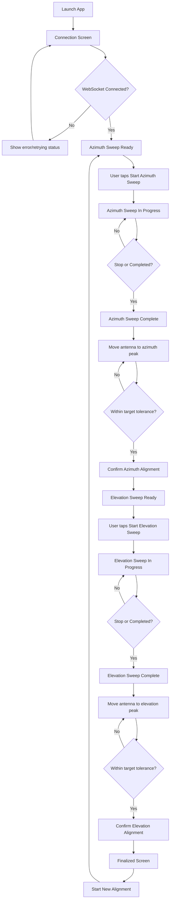

# App Flowchart

```mermaid
flowchart TD
    A[Launch App] --> B[Connection Screen]
    B --> C{WebSocket Connected?}
    C -- No --> D[Show error/retrying status]
    D --> B
    C -- Yes --> E[Azimuth Sweep Ready]

    E --> F[User taps Start Azimuth Sweep]
    F --> G[Azimuth Sweep In Progress]
    G --> H{Stop or Completed?}
    H -- No --> G
    H -- Yes --> I[Azimuth Sweep Complete]

    I --> J[Move antenna to azimuth peak]
    J --> K{Within target tolerance?}
    K -- No --> J
    K -- Yes --> L[Confirm Azimuth Alignment]

    L --> M[Elevation Sweep Ready]
    M --> N[User taps Start Elevation Sweep]
    N --> O[Elevation Sweep In Progress]
    O --> P{Stop or Completed?}
    P -- No --> O
    P -- Yes --> Q[Elevation Sweep Complete]

    Q --> R[Move antenna to elevation peak]
    R --> S{Within target tolerance?}
    S -- No --> R
    S -- Yes --> T[Confirm Elevation Alignment]

    T --> U[Finalized Screen]
    U --> V[Start New Alignment]
    V --> E
```
